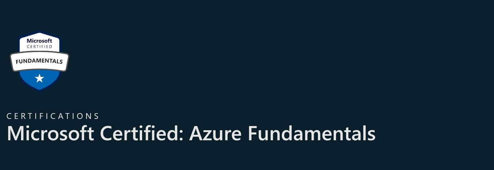

# AZ-900
<h1>Study Notes for the Azure fundamentals exam</h1>

<h1>Azure Architecture</h1>

Azure Accounts

<ul>
<li>You need an Azure subscription to use Azure services.</li>
<li>Azure free account: gives you access to popular products for a year. You need a credit card, phone number and a Microsoft/Github account.</li>
<li>Azure free student account: First 12 months free and free access to developer tools.</li>
<li>Physical Infrastructure starts with the datacenter. Datacenters are grouped into Azure Regions and Availability Zones. </li>
<li><strong>REGION</strong> is a geographical area that contains at least one datacenter. Azure controls the resources within each regions.</li>
<li><strong>Availability Zones</strong> are physically separated datacenters within an Azure region. Made up of one of more datacenters. An availability is set up as an isolation boundary; if one zone goes down, the other continues working.</li>
<li>Availability zones are primarily for VMs, managed disks, load balancers and SQL databases. Azure services that support availability zones: Zonal services, Zone-redundant services, Non-regional services</li>
<li><strong>Region pairs:</strong>Azure regions are paired with another region within the same geography at least 300 miles away. This allows for the replication of resources across a geography that helps reduce the likelihood of interruptions because of events such as natural disasters, civil unrest, power outages, or physical network outages.</li>
<li><strong>Sovereign Regions:</strong> For compliance or legal purposes such as US DoD Central, US Gov Virginia, US Gov Iowa, etc. China East, China North and more.</li>
<li><strong>Azure resources and resource groups:</strong> A resource is the basic building of Azure. Resource groups provide a way to group resources together. One action applied, will go to all resources within the group. If you delete a group, all resources will be deleted.</li>
<li><strong>Azure subscriptions:</strong>Subscriptions are a unit of management, billing, and scale. (Billing boundary & Access control boundary). An account can have multiple subscriptions but it's only required to have one. </li>
<li><strong>Azure management groups:</strong>provide a level of scope above subscriptions. Organize subscriptions into containers and apply governance conditions to the management groups.Management groups could create a hierarchy that applies a policy and provide user access to multiple subscriptions.</li>
</ul>

<h1></h1>
<h1></h1>
<h1>Cloud Computing:</h1>

  <ul>
		 <li>The delivery of computing services over the internet. This includes infrastructure (VMs, storage, DBs, and networking) and IoT, ML, AI</li>
		<li>Cloud helps to rapidly expand IT infrastructure</li>
    </ul>
	
 Shared Responsibility Model
		<ul>
      <li>Responsibilities get shared between the cloud provider and the consumer.</li>
		<li>Physical security, power, cooling and network connectivity are the responsibility of the cloud provider.</li>
		<li>The consumer is responsible for the data and info stored in the cloud</li>
		<li>SaaS, PaaS, IaaS and ON-prem</li>
      </ul>

	
 Cloud models
		<ul>
      <li>Private cloud: provides much greater control for the company and its IT department. Comes with greater cost and fewer benefits.</li>
		<li>Public cloud: built, controlled and maintained by a 3rd party provider. Anyone that wants to purchase cloud services can access and use resources</li>
		<li>Hybrid: both private and public clouds</li>
		<li> Multi-cloud: using multiple cloud providers</li>
		</ul> 

    
<strong>Azure Arc</strong> - helps manage your cloud environment

 Consumption-Based model
<ul>
     <li>CapEx - typically a one-time upfront expenditure to purchase or secure tangible resources. Example:building, parking lot, datacenter, company vehicle</li>
		<li>OEx - spending money on services and products over time
			§ EX: cloud computing because it is consumption-based product. You pay for what you use.</li>
      </ul>

The benefits of high availability and scalability	
    <ol>
    <li>High availability: resources are available when needed, regardless of disruptions or events that may occur. Azure is a high availability cloud environment</li>
<li>Scalability: the ability to adjust resources to meet demand; keeps you from overpaying for services. Only pay for what you use.
			§ Vertical scaling: an app needs more CPUs or RAM
			§ Horizontal scaling: need additional VMs or containers</li>
	<li> <strong>Reliability and Predictability</strong>
		Reliability: is the ability of a system to recover from failures and continue to function</li>
    </ul>
    

<h1> Compute and Networking</h1>
<h3>Azure Vms provide:</h3>
<ul>
  <li>Total control over the Operating System</li>
  <li>Ability to run custom software use custom husting configs</li>
<li>Assure VM gives you flexibility of virtualization without having to maintain the physical hardware</li>
  </ul>
  
You still have to update and maintain software that runs on the VM

  
Single VMs or group VMS together for high availability/scalability/redundancy

  
<strong>VM scale sets</strong> -create & manage a group of identical, load-balanced VMs
<ul>
<li>Build large scale services for areas such as compute, bigdata, container workloads</li>
<li>Centrally manage, configure & update VMS in minutes</li>
<li>The # of VMs can increase or decrease in response to demand or you can set it to scale based on schedule.Auto deploys load balancers</li>
</ul>

  
<strong>VM availability sets</strong> update domain groups that can be rebooted at the same time
Only one update domain group will be offline at a time. 30 min recovery time before update
Fault domain groups your VMs by common power source and network switch.

When to use VMS:
  <ul>
    <li>Testing and Development</li>
    <li>Running apps in the cloud</li>
    <li>Extending datacenter to cloud</li>
    <li>Disaster Recovery</li>
  </ul>
  

VM resources:
<ul><li> size</li>
  <li>storage</li>
  <li> Networking</li>
  </ul>
  

<h3>Azure Containers</h3>
<ul>
  <li>No managing of an operating system</li>
<li>Lightweight, agile</li>
<li>Azure container instances offer the fastest and simplest way to
  run a container in Azure without having to manage any VMS or adopt additional services</li>
<li>Containers are often used to create solutions by using microservice architecture<li>
  </ul>
<h3><strong>Azure Functions</strong></h3>
• Event driven , serverless compute opinion that doesn't require maintaining
Ms or containers.
• With Azure Functions an event wakes the function to Keep resources provisioned . Ideal for when you're running code
• Commonly used when you need to perform work (REST request), timer or message from another Azure serin . Scale automatically based on demand
• Stateful or Stateless
<h3><strong>Azure App Service</strong></h3>

  <ul>
    <li>enables you to build and host web apps, background jobs, mobile back-ends,
      and Restful APIs</li>
    <li>Autoscaling and High Availability</li>
    <li> Supports Windows & Linux</li>
    <li>Deployments from GitHub, Azure Dev ops or any Git repo</li>
</ul>

<h3><strong>Azure Virtual Networks</strong></h3>

  <ul>
    <li>allow Azure resources to communicate with each
      other, other users on the internet, & on prem computers</li>
    <li>Provide : isolation/segmentation [create multiple isolated Mets internet communications route network traffic filter network traffic
      connect nets]</li>
    <li>Supports public and private endpoints for external and internal resources</li>
    

<li>3 mechanisms to achieve connectivity: Point-to-site net private connections
  From outside to internal site-to-site</li>
  </ul>

  
  <h3>Azure Virtual Private Networks</h3>
  <ul>

  <li><strong>VPN gateways</strong> is a type of virtual network gateway. Connect on-premises datacenters to virtual networks through a site-to-site connection, connect individual devices to virtual networks through a point to point connection, connect virtual networks to other virtual networks through a network-to-network connection.</li>
  <li>There are 2 types of VPNs to how traffic should be encrypted: <strong>(1)Policy-based VPN gateways</strong> specifically the IP address of packets that should be encrypted through each tunner; this evaluates every data packet against those sets of IP addresses to choose the tunnel where that packet is going to be sent through.<strong>(2)In Route-based gateways</strong>, IPSec tunnels are modeled as network interfece or virtual tunnel interface. IP routing decides which one of these tunnel interfaces to use when sending each packet. Route-based VPNs are the preferred connection method for on-premises devices (more resilient to topology changes)</li>
</ul>

<h2>Azure Identity, Access and Security</h2>

<ul>
<li>Azure AD enables you to sign in and access both Microsoft cloud apps and cloud apps thatyou develop. Also helps you maintain your on-prem AD deployment. On-prem uses AD running on Windows for IAM. Azure AD is cloud-based IAM.  When you connect AD with Azure AD, Microsoft can help you protect sign- in attempts.

Azure AD is used for: IT admins, App developers, Users, online service subscribers
</li>
<li>Azure AD Connect helps with connecting on-prem AD to AAD.</li>
<li>Azure ADDS - provides managed domain services such as domain join, group policy, LDAP, and Kerberos/NTLM authentication. Domain services without the need to deploy, manage, and patch domain controllers in the cloud. Lets you run legacy apps in the clund that can't use modern auth methods. Integrates with your existing Azure AD tenant.
	•  Unique namespace used as the domain name..
	• 2 Windows Server domain controllers are then deployed into your Aure region (replica set)
Azure handles the DCs.</li>
</ul>

<h2>Authentication Methods</h2>

<ul>
<li>Single Sign-on (SS0) - enables a user to sign in onetime and use that credential to access multiple resources and applications from different providers. Only one ID and one Password. Access across apps is granted to a single identity. Reduces the effort to change or disable accounts. </li>
<li> MFA - prompting a user for an extra form of ID. MFA helps protect against a password compromise in situations where password was compromised. 
	
<ul><li>Something you know - challenge question</li>
		<li>Something you have - code</li>
		<li>Something you are  - biometrics</li></ul>

<li>Passwordless Auth -  password is removed and replaced with something you have, plus something you are or something you know. Needs to be registered on the device before it can work. Once you provide surething you know or are (PIN or biometrics). 
		○ Azure AD: Windows Hello for Business, Microsoft authenticator app, FIDO2 security keys</li>
</ul>

<h2>Azure External Identities</h2>

<ul>
<li>Business to business collab (B2B) - collab with external users by letting them use their preferred identity to sign-in your Microsoft apps or other enterprise apps (SaaS apps, custom developed apps, etc)</li>
<li>B2B direct connect- establish a mutual . two-way trust with another Azure AD org for seamless collab. Supports Teams shared channels </li>
<li>Azure AD B2C - publish modern SaaS apps or custom developed apps to consumers and customers</li>
</ul>

<ul>
<li>Azure conditional access - used to allow or deny access to resources based on who the user is, where they are, what device they're requesting access from. Conditional access also provides more granular MFA for users.</li>
<li>Azure RBAC is applied to a scope (resource or set of resources that this access applies to)
Scope includes: management group, single subscription, resource group, single resource.
RBAC is hierarchical - What's applied to the parent, also applies to all child scopes. Ex: Owner role assigned to user at the management group scope, user manages everything in all subscriptions within the management group
	- uses an "allow" model. When you're assigned a rule, Azure RBAC allows you to perform actions within the scope of that role</li>
<li>Zero Trust Model  - security model that assumes the worst case scenario and protects resources with that expectation. Zero trust assumes breach at the outset and then verifies each request as though it Originated from an uncontrolled network. Requires everyone to authenticate.
	- Verify explicitly
	- Use least privilege access
	- Assume breach
</li>
<li>Defense in Depth 
	- Layers :
		○ Physical  - 1st line of defense, datacenter
		○ Identity & Access  - infrastructure; 
		○ Perimeter  - DDOS protection to filter large scale attacks BEFORE they can cause issues for users; network based attacks
		○ Network - limits communication between resources through segmentation and access controls
		○ Compute - secure VMs and implement endpoint protection
		○ Application - reduce Vulnerabilities, Store sensitive app secrets in a secure storage medium
		○ Data - control access to data and ensure it's properly protected</li>
	</ul>

<h2>Azure for Governance and Compliance</h2>

<ul>
<li>Azure Blueprints - standardize cloud subscriptions or environment deployments. Define repeatable settings and policies that are applied as new subscriptions are created. Artifacts are the components of blueprints. Artifacts are not required.
	• Artifacts include: Role assignments, Policy assignments, ARM templates, Resource groups
	• Blueprints are version-able allowing you to make updates later on and assign a new version.
</li>
<li>Azure Policy is a service in Azure that enables you to create, assign, and manage policies that control or audit your resource Azure Policy enables you to define both indiv policies and groups of related Policy. Policies are inherited so if you set a policy at a high level, Will automatically be applied to all of the groupings that fall within the parent. If you set an Azure Policy on a resource group, all resources are created within that resource group automatically.

Azure Policy comes with built-in policy & initiative definitions

Policy integrate with AzureDevOps by applying any continuous integration and delivery pipeline policies that pertain to the pre-deployment and post deployment phases of your applications

Policy initiatives - a way of grouping related policies together.
</li>
<li>Resource locks prevent resources from being accidentally deleted or changed
	• 2 types: Delete and Read Only
Manage resource locks from the portal, Powershell, CLI or from an ARM template</li>
<li>Service Trust Portal - provides access to various content, tools and other resources about Microsoft security, privacy and compliance practices. You must sign in as an authenticated user with your Microsoft cloud services account (Azure AD org account)
	• Service Trust Portal
	• My Library - save documents to quickly access them on your My Library page
All Documents- single page for documents on the service trust porta</li>
</ul>

<ul>
<li></li></ul>

<ul>
<li></li></ul>

<ul>
<li></li></ul>

<ul>
<li></li></ul>

<ul>
<li></li></ul>

<ul>
<li></li></ul>

<ul>
<li></li></ul>

<ul>
<li></li></ul>

<ul>
<li></li></ul>

<ul>
<li></li></ul>

<ul>
<li></li></ul>

<ul>
<li></li></ul>

<ul>
<li></li></ul>

<ul>
<li></li></ul>

<ul>
<li></li></ul>

